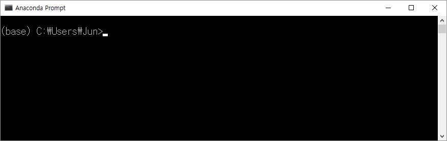

# Pytorch

## Download and Install

1. download & install  [Anaconda](https://docs.anaconda.com/anaconda/install/windows)  
 - Anaconda installs "**Python**" 
 - most of useful packages s.t."**Numpy**","Pandas", "Matplotlib", etcs. 
 - many useful tools s.t. "**Jupyter Notebook**", and so on.
 - most of machine learning API s.t. "**Pytorch**", "**TensorFlow**", and so on.
 
 
2. Start "**Anaconda Prompt**" by typing "Anaconda Prompt"

3. Start "**Jupyter Notebook**" by typing "Jupyter Notebook" on the anaconda prompt
